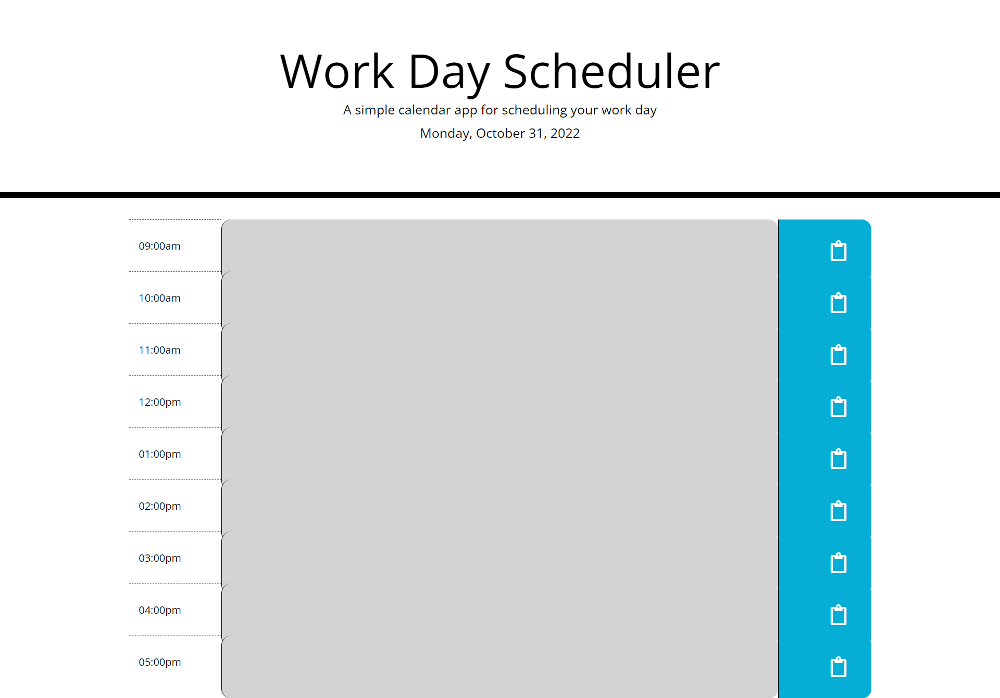

# Work Day Scheduler

## Description

This web application is a simple daily scheduler designed to help people organise their day-work schedule .

## Screenshots

## Usage

- Each time-block is colour-coded according to whether the time is in the past (grey), present (red), or future (green). 
- Users can save events by inputting text in a time-block and then clicking the save button.
- Events can be removed by deleting text and then clicking the save button.

## Link to deployed application

[Deployed application](https://eduardbahrin.github.io/work-day-scheduler/)

## Link to GitHub repository

[Github repository](https://github.com/eduardbahrin/work-day-scheduler)